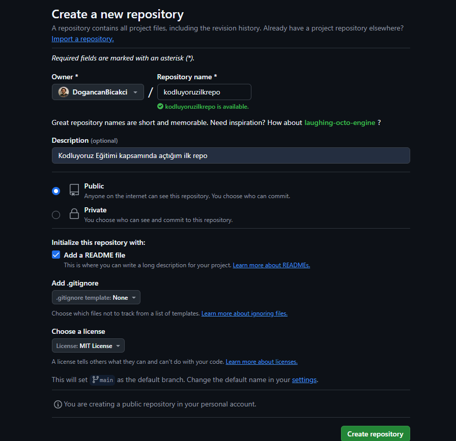

# Kodluyoruz Ilk Repo



Bu repo [kodluyoruz](https://www.kodluyoruz.org) Front-end eğitiminde oluşturduğumuz ilk repo. İçerisinde bir adet README dosyası, bir adet de index.html barındırıyor.

## Installation
Oncelikle projeyi clonelayın. (Buraya sizin reponuzdan aldığınız link gelecek.)
```
git clone https://github.com/DogancanBicakci/kodluyoruzilkrepo.git
```
## Usage
Projeyi cloneladıktan sonra Visual Studio Code programını açınız.

Linux için:
```
cd kodluyoruzilkrepo
code .
```
## Contributing
Pull requestler kabul edilir. Büyük değişiklikler için, lütfen önce neyi değiştirmek istediğinizi tartışmak için bir konu açınız.

## License
[MIT](https://choosealicense.com/licenses/mit/)